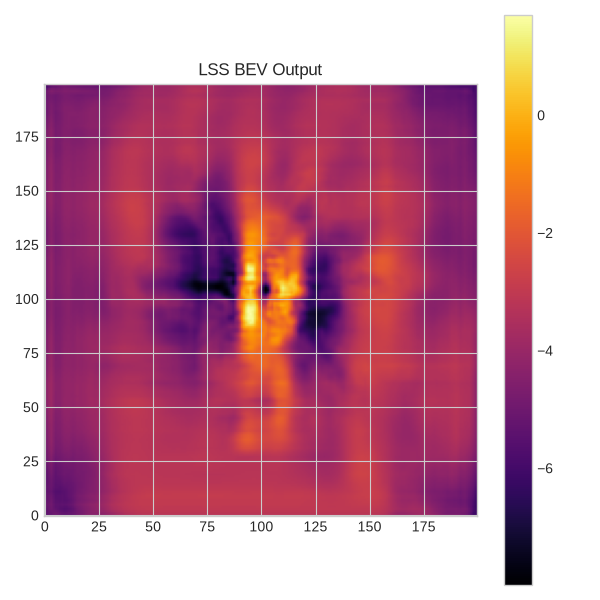

# BEVFusion

Implementation of camera–LiDAR fusion for 3D object detection in PyTorch, with a C++ TensorRT inference engine. Based on [BEVFusion (MIT CSAIL, 2022)](https://arxiv.org/abs/2205.13542), evaluated on the [nuScenes](https://www.nuscenes.org/) benchmark.

## What it does

Takes synchronized camera images (6×) and a LiDAR point cloud as input and outputs 3D bounding boxes with class labels, velocities, and headings.

```
Camera frames (6x)  ──► EfficientNet + LSS BEV Pooling ──┐
                                                           ├──► Fusion Head ──► [class, bbox, velocity]
LiDAR point cloud   ──► PointPillars               ──┘
```

Both modalities are projected into a shared Bird's Eye View (BEV) space before fusion, avoiding the information loss of late-fusion approaches.

## Progress

| Phase | Description | Status |
|-------|-------------|--------|
| 1 | nuScenes data pipeline + coordinate transforms | ✅ Done |
| 2 | Camera encoder: LSS BEV projection | ✅ Done |
| 3 | LiDAR encoder: PointPillars | 🔲 Planned |
| 4 | Fusion head + 3D detection decoder | 🔲 Planned |
| 5 | C++ TensorRT inference engine | 🔲 Planned |

## Project structure

```
BEVFusion/
├── src/
│   └── backbones/
│       ├── lss_model.py        # LiftSplatShoot, CamEncode, BevEncode
│       └── tools.py            # coordinate transforms, cumsum trick, nuScenes utils
├── scripts/
│   ├── run_lss.py              # run LSS on nuScenes mini, visualize BEV output
│   ├── camera_to_bev.py        # project camera images into BEV
│   └── read_nuscenes.py        # explore nuScenes scene/sample structure
├── data/                       # nuScenes dataset (gitignored)
├── images/                     # saved visualizations
└── papers/                     # reference papers
```

Planned additions (Phases 3–5):

```
├── models/
│   ├── camera/                 # Swin-T backbone + BEV pooling
│   ├── lidar/                  # PointPillars encoder
│   └── fusion/                 # fusion neck + detection head
├── experiments/
│   ├── camera_only/
│   ├── lidar_only/
│   └── fused/                  # ablation configs — camera-only → LiDAR-only → fused
├── tracking/                   # Kalman filter tracker
├── inference/                  # C++ TensorRT engine
└── eval/                       # mAP/NDS metrics
```

## Setup

```bash
pip install torch torchvision nuscenes-devkit open3d einops timm efficientnet_pytorch
```

Download the nuScenes dataset (registration required at [nuscenes.org](https://www.nuscenes.org/)). The mini split is sufficient for development.

```bash
python scripts/run_lss.py        # run LSS and visualize BEV output
python scripts/read_nuscenes.py  # explore dataset structure
```

## Target performance (nuScenes val)

| Configuration | mAP | NDS |
|---------------|-----|-----|
| Camera-only baseline | ~35% | ~40% |
| LiDAR-only baseline | ~50% | ~58% |
| BEVFusion (fused) | ~67% | ~71% |

## Lift, Splat, Shoot (LSS)

LSS is the camera-to-BEV transformation at the core of BEVFusion's camera branch. It converts 2D perspective images from all 6 cameras into a single top-down BEV feature map in ego-frame meters.

```
Camera Images (6x)
        │
        ▼
  EfficientNet-b0          ← extracts a hierarchy of visual features
        │
        ▼
   Depth Network           ← predicts a depth probability distribution per pixel
        │
        ▼
   BEV Pooling             ← lifts features to 3D, splats into BEV grid
        │
        ▼
Camera BEV Features
```

### Lift

EfficientNet encodes each image into a feature map. A single 1×1 conv (`depthnet`) then projects those features into `D + C` channels — the first `D` become a depth probability distribution (via softmax), the next `C` are the per-pixel feature vector.

The feature is "lifted" into 3D by distributing it across all D depth bins, weighted by predicted depth probability:

```
new_x[c, d, h, w] = feature[c, h, w] × p(depth=d | h, w)
```

Pixels the network is confident about concentrate their mass at one depth bin. Uncertain pixels spread across several. The total feature energy per pixel is conserved — it just gets distributed across the depth axis.

### Splat

Each `(pixel, depth_bin)` pair is converted to an ego-frame `(x, y, z)` coordinate in meters using the known camera intrinsics and extrinsics — exact math, no learning. Features that land in the same BEV grid cell are summed, and the Z axis is collapsed to produce a flat `[C, X, Y]` BEV feature map.

Because features are expressed in ego-frame meters, all 6 cameras are combined into the same grid naturally — front camera features land in the forward half, rear camera features land in the rear half, with no special handling.

### Why depth estimation works without depth labels

The depth network is never shown a depth map. It learns depth purely from the BEV task loss.

If the depth network assigns a car's features to the wrong depth bin, those features land in the wrong BEV cell, the detection head misses the car, and the loss penalizes it. Gradients flow back through the differentiable BEV pooling operation, through the depth distribution, and the network learns to assign less probability to that depth bin for that visual pattern. Over millions of examples the depth distribution sharpens toward correct answers — not because depth was supervised directly, but because getting the BEV prediction right requires getting the depth right.

This works because autonomous driving scenes are heavily constrained:

- **Ground plane geometry** — the camera is at a known height and pitch. Any object touching the ground at pixel row `v` can be triangulated to an exact depth from calibration alone — the gradient signal pushes the network toward this geometrically correct answer.
- **Known object scales** — cars are ~4m long. Their apparent pixel size is a deterministic function of depth and focal length. The network encodes this after seeing thousands of annotated examples.
- **Vertical image position** — in a forward-facing driving camera, where an object's base sits in the image directly encodes its depth along the ground plane.

Depth is predicted as a probability distribution rather than a single estimate so that the operation remains differentiable. A hard `argmax` would block gradients entirely and make it impossible for the task loss to teach the depth network anything.

The geometry is never learned — converting a depth bin to an ego-frame XYZ coordinate is pure math using the calibration matrices. The network only learns the visual-to-depth mapping: which EfficientNet features correlate with which real-world depths.

### EfficientNet feature hierarchy

EfficientNet progressively downsamples the image, producing richer features at each step:

```
reduction_1:  16ch,  H/2   ← edges, color gradients
reduction_2:  24ch,  H/4   ← textures, corners
reduction_3:  40ch,  H/8   ← parts, shapes
reduction_4: 112ch,  H/16  ← objects
reduction_5: 320ch,  H/32  ← full semantic context, large receptive field
```

LSS merges `reduction_5` (what a pixel means — semantic richness, broad context) with `reduction_4` (where exactly it is — spatial precision at the target resolution `H/16`). Earlier reductions encode only low-level features that carry almost no depth signal. The later reductions have the semantic content — object identity, relative scale, position relative to the horizon — that correlates with depth.

### BEV output on nuScenes mini

Camera inputs (6 views) and the resulting BEV feature map:



## Limitations

**BEV grid alignment** — The BEVFusion paper trains both camera and LiDAR branches jointly from scratch with a shared BEV grid, ensuring spatial alignment by design. This implementation uses pretrained LSS weights from the official LSS repository (Philion & Fidler), which were trained on a fixed 200×200 grid at 0.5m resolution covering ±50m. As a result, the LiDAR branch is configured to match this grid rather than the grid used in the original BEVFusion paper. A proper reproduction would train both branches jointly on the same grid.

## Key papers

- [BEVFusion](https://arxiv.org/abs/2205.13542) — Liang et al., 2022 (primary architecture reference)
- [Lift, Splat, Shoot](https://arxiv.org/abs/2008.05711) — Philion & Fidler, 2020 (camera-to-BEV projection)
- [EfficientNet](https://arxiv.org/abs/1905.11946) — Tan & Le, 2019 (camera feature backbone)
- [PointPillars](https://arxiv.org/abs/1812.05784) — Lang et al., 2019 (LiDAR encoder, Phase 3)
- [Swin Transformer](https://arxiv.org/abs/2103.14030) — Liu et al., 2021 (planned camera backbone upgrade)
- [CenterPoint](https://arxiv.org/abs/2006.11275) — Yin et al., 2021 (detection head and tracker, Phase 4)

## Key Datasets
- [nuScenes](https://www.nuscenes.org/) — 1000 scenes of urban driving with 6 cameras, 1 LiDAR, and 5 radars. 10 object classes, annotated at 2Hz.
- [KITTI](http://www.cvlibs.net/datasets/kitti/) — 7481 scenes with 1 front camera and 1 LiDAR. 3D bounding boxes for cars, pedestrians, cyclists.
- [Waymo Open Dataset](https://waymo.com/open/) — 1000 scenes with 5 cameras and 1 LiDAR. 4 object classes, annotated at 10Hz.
- https://huggingface.co/datasets/Voxel51/kitscenes-multimodal — a multimodal version of KITTI with synchronized camera and LiDAR data, formatted for PyTorch.