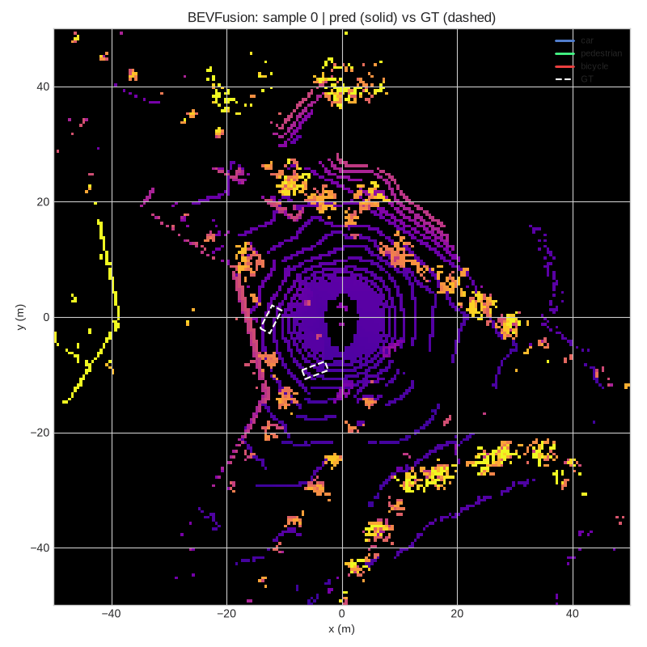

# BEVFusion

Implementation of camera–LiDAR fusion for 3D object detection in PyTorch, with a C++ TensorRT inference engine. Based on [BEVFusion (MIT CSAIL, 2022)](https://arxiv.org/abs/2205.13542), evaluated on the [nuScenes](https://www.nuscenes.org/) benchmark.

## What it does

Takes synchronized camera images (6×) and a LiDAR point cloud as input and outputs 3D bounding boxes with class labels and headings.

```
Camera frames (6x)  ──► EfficientNet + LSS BEV Pooling ──┐
                                                           ├──► Fusion Head ──► [class, bbox, velocity]
LiDAR point cloud   ──► PointPillars               ──┘
```

Both modalities are projected into a shared Bird's Eye View (BEV) space before fusion, avoiding the information loss of late-fusion approaches.

## Progress

| Phase | Description | Status |
|-------|-------------|--------|
| 1 | nuScenes data pipeline + coordinate transforms | ✅ Done |
| 2 | Camera encoder: LSS BEV projection | ✅ Done |
| 3 | LiDAR encoder: PointPillars | ✅ Done |
| 4 | BEV fusion encoder + detection head | ✅ Done |
| 5 | Data loader + loss function + training | ✅ Done |
| 6 | C++ TensorRT inference engine | 🟡 Partial — all 6 sub-models export to ONNX and build to TensorRT `.engine` files; full 6-model pipeline wiring in `infer.cpp` (camera → bev_encode, lidar → pillar_backbone, fusion → ssd) is not yet connected end-to-end |

### Next Steps:
- Wire the full 6-model inference pipeline together in `infer.cpp` and validate against a real sample end-to-end
- INT8 quantization of the TensorRT engines, with accuracy benchmarking against FP32
- Pull additional nuScenes trainval blob parts (currently training on 1 of ~10, 85 of 850 scenes) for a larger, less overfitting-prone training set
- Attribute head, to get a full (not partial) NDS score — see Limitations
- ByteTrack or SORT tracker on top of the detection head output
- Temporal BEV fusion — even just stacking 2-3 past BEV frames as input channels is a meaningful step, and you can cite BEVFormer as motivation

## Project structure

```
BEVFusion/
├── config.yaml
├── src/
│   ├── camera/
│   │   ├── lss.py              # LiftSplatShoot, CamEncode, BevEncode
│   │   └── tools.py            # coordinate transforms, cumsum trick
│   ├── lidar/
│   │   ├── pillarize.py        # point cloud → pillar tensor
│   │   ├── pointnet.py         # shared MLP encoder per pillar
│   │   ├── backbone.py         # 2D conv backbone (multi-scale down + up)
│   │   └── point_pillars.py    # full LiDAR branch orchestrator
│   ├── fusion/
│   │   ├── bev_encoder.py      # concatenate + conv neck
│   │   ├── detection_head.py   # SSD-style cls + reg heads
│   │   └── pipeline.py         # top-level: camera + LiDAR → fused BEV → heads
│   ├── cpp/                    # TensorRT inference engine (C++)
│   │   ├── infer.cpp           # ONNX → .engine build + inference entrypoint
│   │   ├── camera_pipeline.cpp # camera preprocessing
│   │   ├── lidar_pipeline.cpp  # LiDAR preprocessing
│   │   ├── pillarize.cpp       # pillar tensor construction (C++ port)
│   │   └── CMakeLists.txt
│   └── util.py                 # IoU and shared utilities
├── scripts/
│   ├── read_nuscenes.py        # explore nuScenes scene/sample structure
│   ├── visualize.py            # generate all pipeline output images
│   ├── dataloader.py           # nuScenes dataset, scene-based split, multi-sweep LiDAR
│   ├── train.py                # training loop, anchor matching, focal loss, CBGS sampling
│   ├── test.py                 # inference, NMS, height-colored BEV GIF
│   ├── eval.py                 # official nuScenes mAP/NDS evaluation
│   └── export_onnx.py          # export each sub-model to ONNX for the C++ engine
├── engines/                     # exported .onnx + built .engine files
├── checkpoints/                 # saved training checkpoints
├── eval_results/                # eval.py submissions + metrics
└── images/                      # saved visualizations
```

## Setup

```bash
pip install -r requirements.txt
```

Download the nuScenes dataset (registration required at [nuscenes.org](https://www.nuscenes.org/)) and point `config.yaml`'s `data.root`/`data.version` at it:

- **Mini** (`v1.0-mini`, ~4GB, all 10 scenes fully present) — sufficient for pipeline development and quick sanity checks, but too small to train a detector that generalizes.
- **Trainval** (`v1.0-trainval`, ~300GB across ~10 blob parts for the full split) — needed for real training. If you only download some of the blob parts, `dataloader.py` automatically restricts to whichever scenes actually have files on disk (see `available_scene_names`), and `train.py`/`eval.py` split by nuScenes' own scene-level train/val assignment intersected with what's available, rather than a random per-sample split (which would leak correlated frames from the same drive across train and val).

```bash
python scripts/visualize.py      # generate all pipeline output images
python scripts/read_nuscenes.py  # explore dataset structure
python scripts/train.py          # train (see train.py's EPOCHS constant)
python scripts/eval.py [ckpt]    # official nuScenes mAP/NDS eval; defaults to the latest checkpoint matching EPOCHS
python scripts/test.py [ckpt]    # inference + BEV visualization GIF
```

### C++ TensorRT engine

Requires a TensorRT install and the CUDA toolkit (see `src/cpp/CMakeLists.txt` for the expected TensorRT path — update it to match your install).

```bash
cd src/cpp
cmake -S . -B build && cmake --build build
python ../../scripts/export_onnx.py     # produces engines/*.onnx
LD_LIBRARY_PATH=/path/to/TensorRT/lib ./build/infer   # builds engines/*.engine from the ONNX files on first run
```

TensorRT's builder loads GPU-arch-specific resource libraries via `dlopen` at runtime, which doesn't go through the normal linker path — `LD_LIBRARY_PATH` needs to include TensorRT's `lib/` directory whenever running the binary, not just at build time.

## Target performance

The published numbers below (full nuScenes trainval, ~700 scenes, 20 epochs with CBGS) and what this implementation has actually measured are kept separate — this project trains on a small fraction of that data for far fewer epochs, so the gap is expected, not a bug.

### Published (BEVFusion paper, full nuScenes val)

| Configuration | mAP | NDS |
|---------------|-----|-----|
| Camera-only baseline | ~35% | ~40% |
| LiDAR-only baseline | ~50% | ~58% |
| BEVFusion (fused) | ~67% | ~71% |

### Measured (this implementation)

Evaluated with `eval.py` (official nuScenes devkit metrics) on 914 val samples from 23 scenes — the val portion of 1 of ~10 trainval blob parts (85 of 850 scenes total downloaded so far). NDS here is a *partial* score (mAP + ATE/ASE/AOE/AVE, excluding AAE since there's no attribute head — see Limitations), so it isn't directly comparable to the published NDS above.

| Checkpoint | mAP | Partial NDS | Notes |
|---|---|---|---|
| `bevfusion_epoch10.pt` | 0.0000 | 0.0517 | best-generalizing checkpoint found so far |
| `bevfusion_15_epochs.pt` | 0.0000 | 0.0278 | overfit — pedestrian AP collapsed to zero matches entirely |

mAP rounds to 0 at this scale, but the model isn't non-functional: per-class TP errors on its real matches (`bevfusion_epoch10.pt`) are car ATE 1.36m / ASE 0.26 (1−IoU) / AOE 1.20 rad / AVE 3.65 m/s, pedestrian ATE 1.33m / ASE 0.34 / AOE 1.65 rad / AVE 0.99 m/s. Precision is heavily diluted by a large false-positive rate (~205k predicted boxes vs. ~21k GT boxes after filtering) — the model detects real objects but produces far too many low-confidence extras, consistent with training on ~2,500 samples rather than the paper's ~28,000.

## Pipeline Outputs

The Sensor Inputs / Camera BEV / LiDAR BEV / Fused BEV outputs below are from an **untrained model** on a single nuScenes mini sample. Spatial structure visible in the BEV maps comes from the input data, not learned weights — the camera branch uses pretrained LSS weights, while the LiDAR branch and fusion layer are randomly initialized. The Detection Output below that, further down, is from a trained checkpoint on real trainval data — see [Target performance](#target-performance).

### Sensor Inputs

6 synchronized camera views (camera branch input) and a height-colored BEV projection of the raw LiDAR point cloud (LiDAR branch input), both from the same nuScenes mini sample.


### Camera BEV (LSS)

6 camera views lifted into a 200×200 BEV grid using the pretrained LSS model. Brighter regions correspond to areas where the depth network placed higher-confidence features.


### LiDAR BEV (PointPillars)

Raw LiDAR point cloud encoded into a 200×200 BEV grid via pillarization and PointNet encoding. Structure reflects LiDAR point density — denser around the ego vehicle and along road surfaces.


### Fused BEV (BEVFusion)

Camera and LiDAR BEV features concatenated and refined by the convolutional BEV encoder, then passed through the detection head. The fused BEV combines geometric structure from LiDAR with semantic density from cameras.


### Detection Output

10-sample inference loop using `checkpoints/bevfusion_epoch10.pt` (10 epochs on a partial nuScenes trainval split — see [Target performance](#target-performance) for why this checkpoint over the later ones). Background is colored by LiDAR point height (purple = ground, yellow = rooftop). Solid colored boxes are model predictions (blue = car, green = pedestrian, red = bicycle); dashed white boxes are ground truth annotations.



## Lift, Splat, Shoot (LSS)

LSS is the camera-to-BEV transformation at the core of BEVFusion's camera branch. It converts 2D perspective images from all 6 cameras into a single top-down BEV feature map in ego-frame meters.

```
Camera Images (6x)
        │
        ▼
  EfficientNet-b0          ← extracts a hierarchy of visual features
        │
        ▼
   Depth Network           ← predicts a depth probability distribution per pixel
        │
        ▼
   BEV Pooling             ← lifts features to 3D, splats into BEV grid
        │
        ▼
Camera BEV Features
```

### Lift

EfficientNet encodes each image into a feature map. A single 1×1 conv (`depthnet`) then projects those features into `D + C` channels — the first `D` become a depth probability distribution (via softmax), the next `C` are the per-pixel feature vector.

The feature is "lifted" into 3D by distributing it across all D depth bins, weighted by predicted depth probability:

```
new_x[c, d, h, w] = feature[c, h, w] × p(depth=d | h, w)
```

Pixels the network is confident about concentrate their mass at one depth bin. Uncertain pixels spread across several. The total feature energy per pixel is conserved — it just gets distributed across the depth axis.

### Splat

Each `(pixel, depth_bin)` pair is converted to an ego-frame `(x, y, z)` coordinate in meters using the known camera intrinsics and extrinsics — exact math, no learning. Features that land in the same BEV grid cell are summed, and the Z axis is collapsed to produce a flat `[C, X, Y]` BEV feature map.

Because features are expressed in ego-frame meters, all 6 cameras are combined into the same grid naturally — front camera features land in the forward half, rear camera features land in the rear half, with no special handling.

### Why depth estimation works without depth labels

The depth network is never shown a depth map. It learns depth purely from the BEV task loss.

If the depth network assigns a car's features to the wrong depth bin, those features land in the wrong BEV cell, the detection head misses the car, and the loss penalizes it. Gradients flow back through the differentiable BEV pooling operation, through the depth distribution, and the network learns to assign less probability to that depth bin for that visual pattern. Over millions of examples the depth distribution sharpens toward correct answers — not because depth was supervised directly, but because getting the BEV prediction right requires getting the depth right.

This works because autonomous driving scenes are heavily constrained:

- **Ground plane geometry** — the camera is at a known height and pitch. Any object touching the ground at pixel row `v` can be triangulated to an exact depth from calibration alone — the gradient signal pushes the network toward this geometrically correct answer.
- **Known object scales** — cars are ~4m long. Their apparent pixel size is a deterministic function of depth and focal length. The network encodes this after seeing thousands of annotated examples.
- **Vertical image position** — in a forward-facing driving camera, where an object's base sits in the image directly encodes its depth along the ground plane.

Depth is predicted as a probability distribution rather than a single estimate so that the operation remains differentiable. A hard `argmax` would block gradients entirely and make it impossible for the task loss to teach the depth network anything.

The geometry is never learned — converting a depth bin to an ego-frame XYZ coordinate is pure math using the calibration matrices. The network only learns the visual-to-depth mapping: which EfficientNet features correlate with which real-world depths.

### EfficientNet feature hierarchy

EfficientNet progressively downsamples the image, producing richer features at each step:

```
reduction_1:  16ch,  H/2   ← edges, color gradients
reduction_2:  24ch,  H/4   ← textures, corners
reduction_3:  40ch,  H/8   ← parts, shapes
reduction_4: 112ch,  H/16  ← objects
reduction_5: 320ch,  H/32  ← full semantic context, large receptive field
```

LSS merges `reduction_5` (what a pixel means — semantic richness, broad context) with `reduction_4` (where exactly it is — spatial precision at the target resolution `H/16`). Earlier reductions encode only low-level features that carry almost no depth signal. The later reductions have the semantic content — object identity, relative scale, position relative to the horizon — that correlates with depth.

## Limitations

**BEV grid alignment** — The BEVFusion paper trains both camera and LiDAR branches jointly from scratch with a shared BEV grid, ensuring spatial alignment by design. This implementation uses pretrained LSS weights from the official LSS repository (Philion & Fidler), which were trained on a fixed 200×200 grid at 0.5m resolution covering ±50m. As a result, the LiDAR branch is configured to match this grid rather than the grid used in the original BEVFusion paper. A proper reproduction would train both branches jointly on the same grid.

**Class imbalance** — nuScenes' three detection classes here are skewed: car and pedestrian are close in annotation count (~51%/46%), but bicycle is ~17x rarer (~3%). BEVFusion/CenterPoint's own nuScenes configs handle this with CBGS (Class-Balanced Grouping and Sampling, Zhu et al. 2019) — oversampling frames by how rare the classes they contain are, by per-sample presence. This implementation reproduces CBGS faithfully (`train.py`'s `compute_cbgs_weights`), but on this dataset it turns out to help bicycle less than expected: bicycle's rarity is at the *instance* level, not the *frame* level — the same few bicycles apparently stay in view across many consecutive frames, so ~37% of samples contain one despite there being few distinct bicycle objects overall (well above CBGS's 33% uniform target, so its oversampling ratio for bicycle comes out close to 1x). To compensate, the classification loss also applies a per-class weight (`CLASS_WEIGHTS` in `train.py`) that upweights bicycle directly — this is **not** part of the original paper's method, and was added specifically because CBGS alone wasn't sufficient for this dataset's particular imbalance pattern.

**Dataset scale** — training data is currently 1 of ~10 nuScenes trainval blob parts (85 of 850 scenes, ~2,500 train / ~900 val samples), not the full trainval set the paper uses (~700 scenes, ~28,000 samples). This is the primary reason measured mAP is far below the paper's published numbers — see [Target performance](#target-performance).

**Checkpoint selection** — on this dataset, validation loss bottoms out and overfitting sets in around epoch 4-5 of a 15-epoch run; by epoch 15, pedestrian AP had collapsed to zero real matches even though car's metrics stayed roughly stable. `bevfusion_epoch10.pt` (an intermediate checkpoint) generalizes measurably better than the final `bevfusion_15_epochs.pt` — `train.py` doesn't currently implement early stopping or automatic best-checkpoint selection based on validation metrics, so this requires checking manually with `eval.py` across checkpoints, which is what the two rows in the Target performance table above come from.

## Key papers

- [BEVFusion](https://arxiv.org/abs/2205.13542) — Liu et al., 2022 (primary architecture reference)
- [Lift, Splat, Shoot](https://arxiv.org/abs/2008.05711) — Philion & Fidler, 2020 (camera-to-BEV projection)
- [EfficientNet](https://arxiv.org/abs/1905.11946) — Tan & Le, 2019 (camera feature backbone)
- [PointPillars](https://arxiv.org/abs/1812.05784) — Lang et al., 2019 (LiDAR encoder, Phase 3)
- [Swin Transformer](https://arxiv.org/abs/2103.14030) — Liu et al., 2021 (planned camera backbone upgrade)
- [CenterPoint](https://arxiv.org/abs/2006.11275) — Yin et al., 2021 (detection head and tracker, Phase 4)

## Key Datasets
- [nuScenes](https://www.nuscenes.org/) — 1000 scenes of urban driving with 6 cameras, 1 LiDAR, and 5 radars. 10 object classes, annotated at 2Hz.
- [KITTI](http://www.cvlibs.net/datasets/kitti/) — 7481 scenes with 1 front camera and 1 LiDAR. 3D bounding boxes for cars, pedestrians, cyclists.
- [Waymo Open Dataset](https://waymo.com/open/) — 1000 scenes with 5 cameras and 1 LiDAR. 4 object classes, annotated at 10Hz.
- https://huggingface.co/datasets/Voxel51/kitscenes-multimodal — a multimodal version of KITTI with synchronized camera and LiDAR data, formatted for PyTorch.
