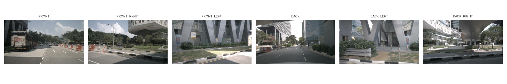
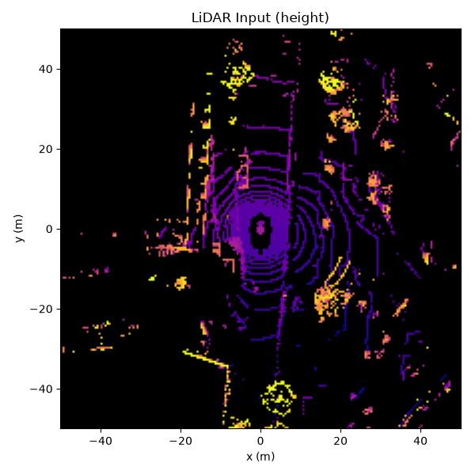
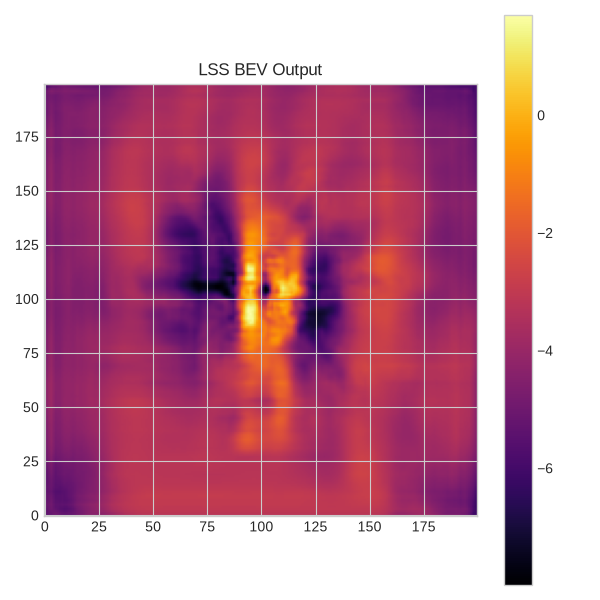
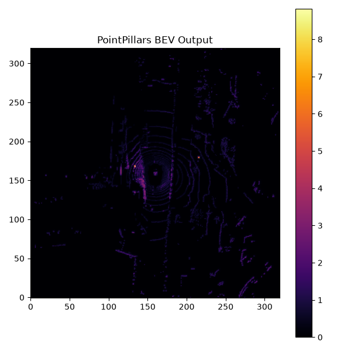
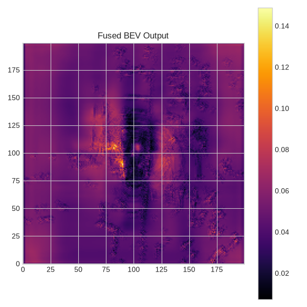
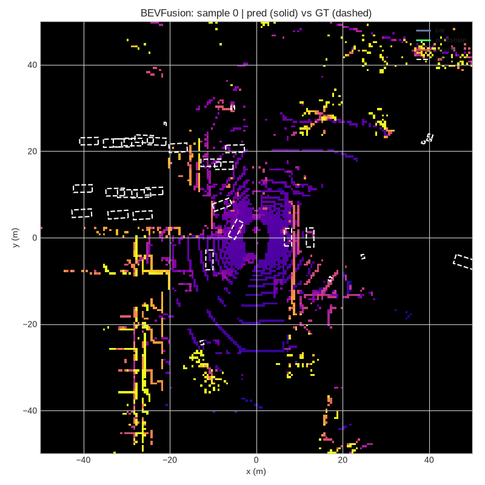

# BEVFusion

Implementation of camera–LiDAR fusion for 3D object detection in PyTorch, with a C++ TensorRT inference engine. Based on [BEVFusion (MIT CSAIL, 2022)](https://arxiv.org/abs/2205.13542), evaluated on the [nuScenes](https://www.nuscenes.org/) benchmark.

## What it does

Takes synchronized camera images (6×) and a LiDAR point cloud as input and outputs 3D bounding boxes with class labels and headings.

```
Camera frames (6x)  ──► EfficientNet + LSS BEV Pooling ──┐
                                                           ├──► Fusion Head ──► [class, bbox, velocity]
LiDAR point cloud   ──► PointPillars               ──┘
```

Both modalities are projected into a shared Bird's Eye View (BEV) space before fusion, avoiding the information loss of late-fusion approaches.

## Progress

| Phase | Description | Status |
|-------|-------------|--------|
| 1 | nuScenes data pipeline + coordinate transforms | ✅ Done |
| 2 | Camera encoder: LSS BEV projection | ✅ Done |
| 3 | LiDAR encoder: PointPillars | ✅ Done |
| 4 | BEV fusion encoder + detection head | ✅ Done |
| 5 | Data loader + loss function + training | ✅ Done |
| 6 | C++ TensorRT inference engine | ✅ Done — all 6 sub-models chained end-to-end, validated against PyTorch stage by stage (see [C++ engine parity](#c-engine-parity)) |

### Next Steps:
- ~~INT8 quantization of the TensorRT engines~~ — proof-of-concept done on `cam_encode`, see [C++ engine parity](#c-engine-parity); deliberately not extended to the other five sub-models (see there for why)
- ~~Multi-sweep LiDAR aggregation in C++~~ — done, see [C++ engine parity](#c-engine-parity); surfaced a separate `MAX_PILLARS` truncation gap on dense scenes, documented there
- Automatic best-checkpoint selection in `train.py` based on validation metrics, rather than picking one manually with `eval.py` afterwards
- Pull additional nuScenes trainval blob parts (currently training on 1 of ~10, 85 of 850 scenes) for a larger, less overfitting-prone training set
- Attribute head, to get a full (not partial) NDS score — see Limitations
- ~~ByteTrack or SORT tracker on top of the detection head output~~ — done, see [Detection Output](#detection-output)'s Tracking note; `scripts/tracker.py`
- Temporal BEV fusion — even just stacking 2-3 past BEV frames as input channels is a meaningful step, and you can cite BEVFormer as motivation

## Project structure

```
BEVFusion/
├── config.yaml
├── src/
│   ├── camera/
│   │   ├── lss.py              # LiftSplatShoot, CamEncode, BevEncode
│   │   └── tools.py            # coordinate transforms, cumsum trick
│   ├── lidar/
│   │   ├── pillarize.py        # point cloud → pillar tensor
│   │   ├── pointnet.py         # shared MLP encoder per pillar
│   │   ├── backbone.py         # 2D conv backbone (multi-scale down + up)
│   │   └── point_pillars.py    # full LiDAR branch orchestrator
│   ├── fusion/
│   │   ├── bev_encoder.py      # concatenate + conv neck
│   │   ├── detection_head.py   # SSD-style cls + reg heads
│   │   └── pipeline.py         # top-level: camera + LiDAR → fused BEV → heads
│   ├── cpp/                    # TensorRT inference engine (C++)
│   │   ├── infer.cpp           # engine build/load + full 6-model pipeline
│   │   ├── geometry.cpp        # LSS get_geometry + voxel_pooling (C++ port)
│   │   ├── camera_pipeline.cpp # image decode, resize, normalize
│   │   ├── lidar_pipeline.cpp  # LiDAR preprocessing
│   │   ├── pillarize.cpp       # pillar tensor construction (C++ port)
│   │   ├── test_geometry.cpp   # geometry/pooling parity check vs PyTorch
│   │   └── CMakeLists.txt
│   └── util.py                 # IoU and shared utilities
├── scripts/
│   ├── read_nuscenes.py        # explore nuScenes scene/sample structure
│   ├── visualize.py            # generate all pipeline output images
│   ├── dataloader.py           # nuScenes dataset, scene-based split, multi-sweep LiDAR
│   ├── train.py                # training loop, anchor matching, focal loss, CBGS sampling
│   ├── test.py                 # inference, NMS, height-colored BEV GIF
│   ├── eval.py                 # official nuScenes mAP/NDS evaluation
│   ├── export_onnx.py          # export sub-models to ONNX with trained weights
│   ├── dump_sample.py          # dump one sample + reference tensors for the C++ engine
│   └── compare_cpp.py          # diff C++ engine stages against PyTorch
├── engines/                     # exported .onnx + built .engine files
├── checkpoints/                 # saved training checkpoints
├── eval_results/                # eval.py submissions + metrics
├── data/                        # sample + reference tensors (dump_sample.py)
└── images/                      # saved visualizations
```

## Setup

```bash
pip install -r requirements.txt
```

Download the nuScenes dataset (registration required at [nuscenes.org](https://www.nuscenes.org/)) and point `config.yaml`'s `data.root`/`data.version` at it:

- **Mini** (`v1.0-mini`, ~4GB, all 10 scenes fully present) — sufficient for pipeline development and quick sanity checks, but too small to train a detector that generalizes.
- **Trainval** (`v1.0-trainval`, ~300GB across ~10 blob parts for the full split) — needed for real training. If you only download some of the blob parts, `dataloader.py` automatically restricts to whichever scenes actually have files on disk (see `available_scene_names`), and `train.py`/`eval.py` split by nuScenes' own scene-level train/val assignment intersected with what's available, rather than a random per-sample split (which would leak correlated frames from the same drive across train and val).

```bash
python scripts/visualize.py      # generate all pipeline output images
python scripts/read_nuscenes.py  # explore dataset structure
python scripts/train.py          # train (see train.py's EPOCHS constant)
python scripts/eval.py [ckpt]    # official nuScenes mAP/NDS eval; defaults to bevfusion_best.pt (see default_checkpoint())
python scripts/test.py [ckpt]    # inference + BEV visualization GIF
```

### C++ TensorRT engine

Requires a TensorRT install and the CUDA toolkit (see `src/cpp/CMakeLists.txt` for the expected TensorRT path — update it to match your install).

```bash
cmake -S src/cpp -B src/cpp/build && cmake --build src/cpp/build

python scripts/export_onnx.py [ckpt]   # engines/*.onnx, weights from a trained checkpoint
python scripts/dump_sample.py [idx]    # data/ — one sample + PyTorch reference tensors

# Builds engines/*.engine from the ONNX files on first run, then runs the
# full 6-model pipeline and prints decoded detections.
LD_LIBRARY_PATH=/path/to/TensorRT/lib ./src/cpp/build/infer data
```

TensorRT's builder loads GPU-arch-specific resource libraries via `dlopen` at runtime, which doesn't go through the normal linker path — `LD_LIBRARY_PATH` needs to include TensorRT's `lib/` directory whenever running the binary, not just at build time.

`export_onnx.py` loads weights from a trained checkpoint (default: `checkpoints/bevfusion_best.pt` if present, else the newest `.pt` — see `common.default_checkpoint`) and splits the state dict across the six sub-models. Exporting freshly-constructed modules instead would produce engines full of random weights that run fine and detect nothing.

`infer` flags: `--ref-images` swaps the JPEG decode for PyTorch's exact preprocessed images (isolates pipeline correctness from image-decode differences), and `--strict-fp32` clears TensorRT's default TF32 mode. Engines are cached per precision, so the two modes don't share a build.

## C++ engine parity

The engine is validated against PyTorch rather than just checked for "it ran". Two harnesses:

```bash
./src/cpp/build/test_geometry data   # geometry/pooling port, no TensorRT needed
./src/cpp/build/infer data --ref-images && python scripts/compare_cpp.py
```

`test_geometry` checks the two hand-ported stages that have no learned weights — `get_geometry` and `voxel_pooling` — against PyTorch on identical inputs: max abs difference 1.1e-05 and 1.0e-03 respectively.

`compare_cpp.py` diffs all eight pipeline stages. Judged on *relative* error, since later stages carry much larger activations and a fixed absolute threshold would flag harmless drift in big tensors while missing real errors in small ones.

| Mode | Worst relative error | Notes |
|---|---|---|
| `--ref-images` (identical inputs) | 5.5e-03 | Pipeline wiring only |
| default (JPEG decode in C++) | 5.8e-02 | Adds image-decode differences |

With identical inputs every stage lands in a 0.03–0.5% band that neither compounds nor blows up, and the independent LiDAR path shows the same magnitude — the signature of TensorRT choosing different conv kernels and accumulation orders than PyTorch, not a wiring fault. (For contrast: an ImageNet-normalization mismatch caught during this work sat at ~250% relative, a completely different signature.) Disabling TF32 narrows it only slightly, so most of the remainder is ordinary FP32 kernel variation.

The default path adds a larger gap from image preprocessing: stb's JPEG decoder and Catmull-Rom resize don't reproduce libjpeg + PIL's BICUBIC exactly (mean pixel difference 0.12/255, worst case 18/255). This does not change detections — on the validation sample both produce identical detection counts at every score threshold, the top score differs by 0.0019, and 979 of the top 1000 anchors agree.

**Multi-sweep aggregation** now runs in C++ (`lidar_pipeline.cpp`'s `aggregate_multisweep`, a port of nuscenes-devkit's `LidarPointCloud.from_file_multisweep`) rather than depending on a Python-computed cloud — `dump_sample.py` now dumps the raw per-sweep scans and calibration instead of a pre-aggregated point cloud. Verified against the Python reference two ways: the aggregated cloud itself matches point-for-point (identical count, max abs diff ~9e-5 — floating-point noise), and with `--ref-images --strict-fp32` all 8 `compare_cpp.py` stages pass on a sample with a normal pillar count.

**Known gap:** `pointnet`'s ONNX export fixes the pillar-tensor shape at `MAX_PILLARS=10000` (`export_onnx.py`), but PyTorch itself has no such cap. Found while validating the port above: a densely-populated sample (10 full sweeps, ~265k points) produced 15,493 occupied pillars, and truncating to 10,000 for the fixed-shape engine input diverged sharply from the PyTorch reference (`lidar_bev` relative error 0.88, vs. <0.2% on a low-density sample) — the C++ path silently drops ~5,500 real pillars in dense scenes rather than raising an error. A fix would mean re-exporting `pointnet`/`pillar_backbone` at a higher `MAX_PILLARS` (or dynamic axes) and rebuilding those two engines.

## Target performance

The published numbers below (full nuScenes trainval, ~700 scenes, 20 epochs with CBGS) and what this implementation has actually measured are kept separate — this project trains on a small fraction of that data for far fewer epochs, so the gap is expected, not a bug.

### Published (BEVFusion paper, full nuScenes val)

| Configuration | mAP | NDS |
|---------------|-----|-----|
| Camera-only baseline | ~35% | ~40% |
| LiDAR-only baseline | ~50% | ~58% |
| BEVFusion (fused) | ~67% | ~71% |

### Measured (this implementation)

Evaluated with `eval.py` (official nuScenes devkit metrics) on 914 val samples from 23 scenes — the val portion of 1 of ~10 trainval blob parts (85 of 850 scenes total downloaded so far). NDS here is a *partial* score (mAP + ATE/ASE/AOE/AVE, excluding AAE since there's no attribute head — see Limitations), so it isn't directly comparable to the published NDS above.

| Checkpoint | Resolution | mAP | Partial NDS | Notes |
|---|---|---|---|---|
| `bevfusion_epoch10.pt` | 128×352 | 0.0000 | 0.0517 | best of the first 15-epoch run |
| `bevfusion_15_epochs.pt` | 128×352 | 0.0000 | 0.0278 | same run, final epoch — overfit, pedestrian AP collapsed entirely |
| `bevfusion_epoch3.pt` | 256×704 | 0.0000 | 0.0000 | dead — no real matches yet |
| `bevfusion_epoch6.pt` | 256×704 | 0.0000 | 0.0000 | dead |
| `bevfusion_epoch9.pt` | 256×704 | 0.0000 | 0.0518 | crosses into real matches somewhere between epoch 6 and 9 |
| **`bevfusion_epoch12.pt`** | 256×704 | 0.0000 | **0.0519** | best of the retrain — used below for the C++ engine and Detection Output |
| `bevfusion_epoch15.pt` | 256×704 | 0.0000 | 0.0515 | |

mAP rounds to 0 at this scale throughout, but the model isn't non-functional — see the per-class TP errors below. Two findings from retraining at 256×704 worth being explicit about:

- **Resolution didn't help.** 256×704 is ~4x the camera pixels and took 8h40m to train, yet its best score (0.0519) is statistically indistinguishable from the 128×352 run's best (0.0517) — a difference of 0.0002 is noise, not signal. The per-class detail shows why it's a wash rather than an improvement: car's ATE and AVE both got slightly better, but car's AOE (orientation) got measurably *worse* (1.199→1.497 rad). Training data size (~2,462 samples either way) is the binding constraint, not input resolution.
- **The failure mode changed.** The 128×352 run showed classic overfitting — a clear peak at epoch 10, then collapse. The 256×704 run instead shows a threshold effect: epochs 3 and 6 are completely dead (every TP metric still at its "no match" fallback value), something crosses over between epoch 6 and 9, and epochs 9/12/15 are then flat and interchangeable — no further degradation, but no further improvement either.

Per-class TP errors for the current best (`bevfusion_epoch12.pt`): car ATE 1.27m / ASE 0.25 (1−IoU) / AOE 1.50 rad / AVE 2.97 m/s, pedestrian ATE 1.35m / ASE 0.35 / AOE 1.52 rad / AVE 0.98 m/s. Precision is heavily diluted by a large false-positive rate (~359k predicted boxes vs. ~21k GT boxes after filtering) — the model detects real objects but produces far too many low-confidence extras.

## Pipeline Outputs

The Sensor Inputs / Camera BEV / LiDAR BEV / Fused BEV outputs below are from an **untrained model** on a single nuScenes mini sample. Spatial structure visible in the BEV maps comes from the input data, not learned weights — the camera branch uses pretrained LSS weights, while the LiDAR branch and fusion layer are randomly initialized. The Detection Output below that, further down, is from a trained checkpoint on real trainval data — see [Target performance](#target-performance).

### Sensor Inputs

6 synchronized camera views (camera branch input) and a height-colored BEV projection of the raw LiDAR point cloud (LiDAR branch input), both from the same nuScenes mini sample.





### Camera BEV (LSS)

6 camera views lifted into a 200×200 BEV grid using the pretrained LSS model. Brighter regions correspond to areas where the depth network placed higher-confidence features.



### LiDAR BEV (PointPillars)

Raw LiDAR point cloud encoded into a 200×200 BEV grid via pillarization and PointNet encoding. Structure reflects LiDAR point density — denser around the ego vehicle and along road surfaces.



### Fused BEV (BEVFusion)

Camera and LiDAR BEV features concatenated and refined by the convolutional BEV encoder, then passed through the detection head. The fused BEV combines geometric structure from LiDAR with semantic density from cameras.



### Detection Output

10 consecutive frames from **held-out validation scenes** using `checkpoints/bevfusion_epoch12.pt`, the best of the 256×704 retrain (see [Target performance](#target-performance)). Background is colored by LiDAR point height (purple = ground, yellow = rooftop). Solid colored boxes are **tracked** model predictions (blue = car, green = pedestrian, red = bicycle), labeled with class, a persistent track ID, and score; dashed white boxes are ground truth annotations.

Rendered at a **0.1 score threshold**, not the 0.3 used elsewhere: confidence on unseen scenes typically peaks around 0.14–0.25 for this checkpoint (a bit higher than the 128×352 run's 0.11–0.16, though NDS came out the same — see Target performance), and at 0.3 most frames still emit nothing. Raw per-frame detections are run through `scripts/tracker.py`'s SORT-style tracker before rendering — a detection has to be matched across 2 consecutive frames before it's confirmed and drawn, which suppresses the one-off flicker in the raw per-frame output but costs a frame of lag on genuinely new objects (see the tracker note below). That's why counts here (0–10 tracked boxes/frame) are lower than the raw decode's 10–26/frame; read them honestly regardless — even confirmed tracks are against 32–37 ground-truth boxes per frame, and many are still low-confidence given the ~359k-vs-~21k raw box imbalance noted above. That's what training on ~2,500 samples buys, and it matches the near-zero mAP in the table above rather than contradicting it.

**Tracking** — the model has no temporal memory: it runs each frame independently, so a real object can flicker in and out or jump in position/size purely from frame-to-frame noise. `scripts/tracker.py` adds a lightweight SORT-style tracker on top of the raw detections: it predicts each track's next position using the model's own regressed velocity (vx, vy) — standard SORT fits a Kalman filter for this, but the model already outputs velocity directly, so there's no filter to fit — matches new detections to predictions via BEV IoU (Hungarian assignment), and ages out tracks after `MAX_AGE` (3) missed frames. This fixes the visual jitter but not detection quality itself: a track's box is only as good as the detection it was matched to.



## Lift, Splat, Shoot (LSS)

LSS is the camera-to-BEV transformation at the core of BEVFusion's camera branch. It converts 2D perspective images from all 6 cameras into a single top-down BEV feature map in ego-frame meters.

```
Camera Images (6x)
        │
        ▼
  EfficientNet-b0          ← extracts a hierarchy of visual features
        │
        ▼
   Depth Network           ← predicts a depth probability distribution per pixel
        │
        ▼
   BEV Pooling             ← lifts features to 3D, splats into BEV grid
        │
        ▼
Camera BEV Features
```

### Lift

EfficientNet encodes each image into a feature map. A single 1×1 conv (`depthnet`) then projects those features into `D + C` channels — the first `D` become a depth probability distribution (via softmax), the next `C` are the per-pixel feature vector.

The feature is "lifted" into 3D by distributing it across all D depth bins, weighted by predicted depth probability:

```
new_x[c, d, h, w] = feature[c, h, w] × p(depth=d | h, w)
```

Pixels the network is confident about concentrate their mass at one depth bin. Uncertain pixels spread across several. The total feature energy per pixel is conserved — it just gets distributed across the depth axis.

### Splat

Each `(pixel, depth_bin)` pair is converted to an ego-frame `(x, y, z)` coordinate in meters using the known camera intrinsics and extrinsics — exact math, no learning. Features that land in the same BEV grid cell are summed, and the Z axis is collapsed to produce a flat `[C, X, Y]` BEV feature map.

Because features are expressed in ego-frame meters, all 6 cameras are combined into the same grid naturally — front camera features land in the forward half, rear camera features land in the rear half, with no special handling.

### Why depth estimation works without depth labels

The depth network is never shown a depth map. It learns depth purely from the BEV task loss.

If the depth network assigns a car's features to the wrong depth bin, those features land in the wrong BEV cell, the detection head misses the car, and the loss penalizes it. Gradients flow back through the differentiable BEV pooling operation, through the depth distribution, and the network learns to assign less probability to that depth bin for that visual pattern. Over millions of examples the depth distribution sharpens toward correct answers — not because depth was supervised directly, but because getting the BEV prediction right requires getting the depth right.

This works because autonomous driving scenes are heavily constrained:

- **Ground plane geometry** — the camera is at a known height and pitch. Any object touching the ground at pixel row `v` can be triangulated to an exact depth from calibration alone — the gradient signal pushes the network toward this geometrically correct answer.
- **Known object scales** — cars are ~4m long. Their apparent pixel size is a deterministic function of depth and focal length. The network encodes this after seeing thousands of annotated examples.
- **Vertical image position** — in a forward-facing driving camera, where an object's base sits in the image directly encodes its depth along the ground plane.

Depth is predicted as a probability distribution rather than a single estimate so that the operation remains differentiable. A hard `argmax` would block gradients entirely and make it impossible for the task loss to teach the depth network anything.

The geometry is never learned — converting a depth bin to an ego-frame XYZ coordinate is pure math using the calibration matrices. The network only learns the visual-to-depth mapping: which EfficientNet features correlate with which real-world depths.

### EfficientNet feature hierarchy

EfficientNet progressively downsamples the image, producing richer features at each step:

```
reduction_1:  16ch,  H/2   ← edges, color gradients
reduction_2:  24ch,  H/4   ← textures, corners
reduction_3:  40ch,  H/8   ← parts, shapes
reduction_4: 112ch,  H/16  ← objects
reduction_5: 320ch,  H/32  ← full semantic context, large receptive field
```

LSS merges `reduction_5` (what a pixel means — semantic richness, broad context) with `reduction_4` (where exactly it is — spatial precision at the target resolution `H/16`). Earlier reductions encode only low-level features that carry almost no depth signal. The later reductions have the semantic content — object identity, relative scale, position relative to the horizon — that correlates with depth.

## Limitations

**BEV grid alignment** — The BEVFusion paper trains both camera and LiDAR branches jointly from scratch with a shared BEV grid, ensuring spatial alignment by design. This implementation uses pretrained LSS weights from the official LSS repository (Philion & Fidler), which were trained on a fixed 200×200 grid at 0.5m resolution covering ±50m. As a result, the LiDAR branch is configured to match this grid rather than the grid used in the original BEVFusion paper. A proper reproduction would train both branches jointly on the same grid.

**Class imbalance** — nuScenes' three detection classes here are skewed: car and pedestrian are close in annotation count (~51%/46%), but bicycle is ~17x rarer (~3%). BEVFusion/CenterPoint's own nuScenes configs handle this with CBGS (Class-Balanced Grouping and Sampling, Zhu et al. 2019) — oversampling frames by how rare the classes they contain are, by per-sample presence. This implementation reproduces CBGS faithfully (`train.py`'s `compute_cbgs_weights`), but on this dataset it turns out to help bicycle less than expected: bicycle's rarity is at the *instance* level, not the *frame* level — the same few bicycles apparently stay in view across many consecutive frames, so ~37% of samples contain one despite there being few distinct bicycle objects overall (well above CBGS's 33% uniform target, so its oversampling ratio for bicycle comes out close to 1x). To compensate, the classification loss also applies a per-class weight (`CLASS_WEIGHTS` in `train.py`) that upweights bicycle directly — this is **not** part of the original paper's method, and was added specifically because CBGS alone wasn't sufficient for this dataset's particular imbalance pattern.

**Dataset scale** — training data is currently 1 of ~10 nuScenes trainval blob parts (85 of 850 scenes, ~2,500 train / ~900 val samples), not the full trainval set the paper uses (~700 scenes, ~28,000 samples). This is the primary reason measured mAP is far below the paper's published numbers — see [Target performance](#target-performance).

**Checkpoint selection** — validation loss is a weak proxy for measured mAP/NDS on this dataset, and the two 15-epoch runs so far failed in different ways. At 128×352, validation loss bottomed around epoch 4-5 and pedestrian AP collapsed to zero real matches by epoch 15 — classic overfitting, with the intermediate `bevfusion_epoch10.pt` clearly beating the final checkpoint. At 256×704, there was no collapse at all: epochs 3 and 6 are simply dead (no real matches yet), something crosses over between epoch 6 and 9, and epochs 9/12/15 are then statistically flat. Neither pattern would have been caught by watching validation loss alone (see `train.py`'s `EARLY_STOP_PATIENCE` comment, which walks through why it's disabled), and the best checkpoint by validation loss (`bevfusion_best.pt`'s original pick, epoch 1) was nowhere near the actual best by measured NDS in either run. `train.py` saves a checkpoint every `CHECKPOINT_EVERY` epochs specifically so `eval.py` can be run across several candidates rather than trusting any loss-based proxy.

**Resolution vs. dataset size** — retraining at 256×704 (~4x the camera pixels of the original 128×352 setup, 8h40m to train) produced no measurable improvement: best Partial NDS went from 0.0517 to 0.0519, a difference within noise. Per-class TP errors show a genuine mix of small gains and losses rather than a systematic improvement (car's translation and velocity error both improved; its orientation error got measurably worse). With the same ~2,462 training samples either way, input resolution isn't the bottleneck — see [Target performance](#target-performance).

**Post-processing has no headroom left** — `scripts/sweep_thresholds.py` grid-searched score threshold (0.05–0.6) x NMS IoU (0.1–0.7) against `bevfusion_epoch12.pt` on the full 914-sample val set, re-using a single cached forward pass per sample so only the decode/NMS/eval step reran per combination. NMS IoU turned out to be irrelevant (0.0519–0.0520 across the whole 0.1–0.7 range). Score threshold is worse than irrelevant: raising it from the current default of 0.05 to just 0.08 collapses Partial NDS to exactly 0.0000 — every TP metric for every class drops below nuScenes' 10%-recall floor simultaneously, and mAP stays at 0.0000 across all 50 combinations regardless of threshold or NMS setting. The real detections and the false-positive noise occupy the same narrow confidence band (~0.05–0.08); there's no score gap a threshold could exploit. This confirms the near-zero mAP is a model-calibration/dataset-scale problem, not a tunable post-processing setting — `test.py`/`eval.py`'s current defaults are already at the peak of what this checkpoint can do.

## Key papers

- [BEVFusion](https://arxiv.org/abs/2205.13542) — Liu et al., 2022 (primary architecture reference)
- [Lift, Splat, Shoot](https://arxiv.org/abs/2008.05711) — Philion & Fidler, 2020 (camera-to-BEV projection)
- [EfficientNet](https://arxiv.org/abs/1905.11946) — Tan & Le, 2019 (camera feature backbone)
- [PointPillars](https://arxiv.org/abs/1812.05784) — Lang et al., 2019 (LiDAR encoder, Phase 3)
- [Swin Transformer](https://arxiv.org/abs/2103.14030) — Liu et al., 2021 (planned camera backbone upgrade)
- [CenterPoint](https://arxiv.org/abs/2006.11275) — Yin et al., 2021 (detection head and tracker, Phase 4)

## Key Datasets
- [nuScenes](https://www.nuscenes.org/) — 1000 scenes of urban driving with 6 cameras, 1 LiDAR, and 5 radars. 10 object classes, annotated at 2Hz.
- [KITTI](http://www.cvlibs.net/datasets/kitti/) — 7481 scenes with 1 front camera and 1 LiDAR. 3D bounding boxes for cars, pedestrians, cyclists.
- [Waymo Open Dataset](https://waymo.com/open/) — 1000 scenes with 5 cameras and 1 LiDAR. 4 object classes, annotated at 10Hz.
- https://huggingface.co/datasets/Voxel51/kitscenes-multimodal — a multimodal version of KITTI with synchronized camera and LiDAR data, formatted for PyTorch.
